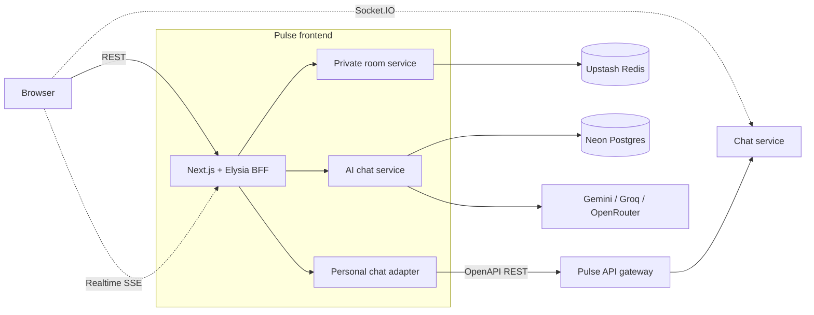

<div align="center">

# PULSE

### Every conversation deserves the right space.

One platform for personal messages, self-destructing private rooms, and AI conversations.

[**Open Pulse**](https://pulse-chat.tarunapps.com) · [**Backend repository**](https://github.com/Tarun222999/fullstack_microservice)

[](https://github.com/Tarun222999/frontend-chat-app/actions/workflows/ci.yml)


</div>


## About Pulse

Pulse is a chat workspace that gives each kind of conversation a purpose-built home:

| Space | Designed for | Highlights |
| --- | --- | --- |
| **Personal** | Everyday conversations | Accounts, inbox, message history, realtime delivery, and private-room sharing |
| **Private** | Sensitive, short-lived exchanges | Two-person rooms, browser-side AES-GCM encryption, and automatic deletion after 10 minutes |
| **AI** | Persistent assistant threads | Streaming responses, conversation history, and Free, Fast, and Balanced model profiles |

The frontend acts as a typed backend-for-frontend. Personal chat is connected to the [Pulse microservices platform](https://github.com/Tarun222999/fullstack_microservice), while private rooms and AI chat are handled by focused server modules inside the Next.js application.

## Product tour

### Personal chat

Sign in, discover people, and continue direct conversations across sessions. Messages arrive over Socket.IO, while history and authentication flow through the same-origin BFF. Private rooms can also be shared directly inside a personal conversation, so a durable chat can move into an encrypted, temporary space when needed.


### Private chat

Create a room without an account. Pulse generates a 256-bit key in the browser, keeps it in the URL fragment, and uses it locally for AES-GCM encryption and decryption. A room accepts two participants and expires after 10 minutes, or either participant can destroy it early.


### AI chat

Create persistent assistant threads and choose between configurable Free, Fast, and Balanced profiles. Provider mode supports Google Gemini, Groq, and OpenRouter through the Vercel AI SDK; mock mode keeps local UI work provider-free.


## Architecture



The deployed personal-chat backend is a polyglot microservices system with independently owned data stores, RabbitMQ events, Redis caching, and a public gateway.


<details>
<summary><strong>Observability</strong></summary>

The backend exports OpenTelemetry data to a Grafana stack for distributed traces and service-level metrics.

| Jaeger traces | Prometheus metrics |
| --- | --- |
|  |  |

</details>

## Tech stack

| Area | Technology |
| --- | --- |
| Application | Next.js 16 App Router, React 19, TypeScript, Tailwind CSS 4 |
| API layer | Elysia, Eden Treaty, generated OpenAPI types, Zod |
| Client data | TanStack Query, Socket.IO Client, Upstash Realtime |
| Storage | Neon Postgres, Drizzle ORM, Upstash Redis |
| AI | Vercel AI SDK, Google Gemini, Groq, OpenRouter |
| Security | HttpOnly session cookies, Web Crypto API, AES-GCM |
| Quality | Vitest, Testing Library, ESLint, TypeScript, GitHub Actions |

## Getting started

### Prerequisites

- [Bun 1.3+](https://bun.sh/)
- An [Upstash Redis](https://upstash.com/) database for sessions and private rooms
- A [Neon](https://neon.com/) Postgres database for AI conversation storage
- The [Pulse backend](https://github.com/Tarun222999/fullstack_microservice) for real personal-chat data, or mock mode for frontend-only development

### 1. Install the project

```bash
git clone https://github.com/Tarun222999/frontend-chat-app.git
cd frontend-chat-app
bun install
```

### 2. Configure the environment

```bash
cp .env.example .env
```

Fill in the Redis and Postgres values. For a frontend-only personal-chat experience, change the service mode in `.env`:

```dotenv
PERSONAL_CHAT_SERVICE_MODE=mock
AI_CHAT_SERVICE_MODE=mock
```

To use the real backend, keep `PERSONAL_CHAT_SERVICE_MODE=gateway` and set both gateway URLs. To call live AI models, set `AI_CHAT_SERVICE_MODE=provider` and add the API keys required by your selected profiles. Every supported option is documented in [`.env.example`](./.env.example).

### 3. Prepare the database

```bash
bun run db:migrate
```

### 4. Start Pulse

```bash
bun run dev
```

Open [http://localhost:3000](http://localhost:3000).

## Available commands

| Command | Purpose |
| --- | --- |
| `bun run dev` | Start the development server |
| `bun run build` | Create a production build |
| `bun run start` | Run the production build |
| `bun run lint` | Check the code with ESLint |
| `bun run typecheck` | Run TypeScript without emitting files |
| `bun run test` | Run the Vitest suite once |
| `bun run test:watch` | Run tests in watch mode |
| `bun run db:generate` | Generate a Drizzle migration |
| `bun run db:migrate` | Apply Drizzle migrations |
| `bun run check:personal-chat-transport` | Verify generated OpenAPI transport types are current |

## Project structure

```text
src/
├── app/                    # App Router pages, layouts, and API entry points
├── components/             # Shared interface and route-state components
├── db/                     # Drizzle client and AI chat schema
├── features/
│   ├── ai-chat/            # AI domain, provider, storage, API, and UI
│   ├── auth/               # Shared route and session guards
│   ├── personal-chat/      # Gateway adapters, realtime client, domain, and UI
│   └── private-chat/       # Temporary room lifecycle and authorization
├── hooks/                  # Shared client hooks
├── lib/                    # Redis, realtime, encryption, logging, and API client
└── proxy.ts                # Private-room admission and route protection
```

## Security notes

- Private-room message content is encrypted and decrypted in the browser.
- The private-room key lives after `#` in the shared URL, so it is not included in HTTP requests.
- Rooms are limited to two participants and their Redis metadata expires after 10 minutes.
- Personal-chat browser sessions use HttpOnly cookies, with server-side gateway session records stored in Redis.
- Logs pass through centralized redaction before structured metadata is emitted.

## Related project

The production personal-chat APIs, realtime service, email delivery, event bus, databases, and observability stack live in [**Tarun222999/fullstack_microservice**](https://github.com/Tarun222999/fullstack_microservice).

---

<div align="center">
Built as one workspace for conversations that should last, disappear, or think with you.
</div>
